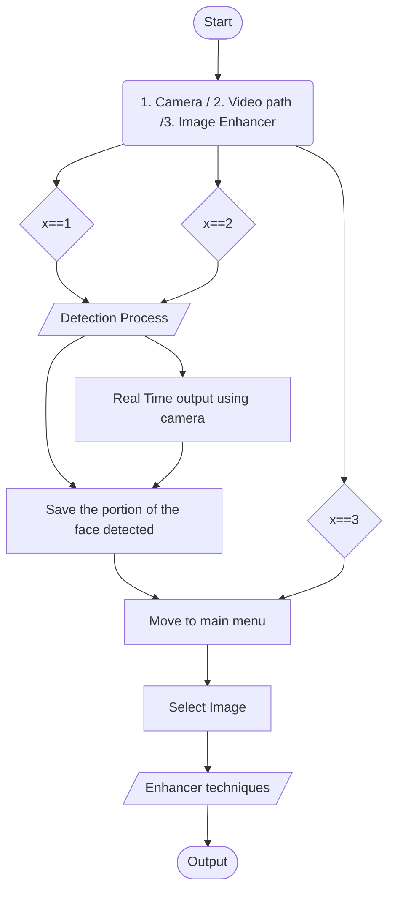

Use of haarcascade_frontalface_default.xml will detect the front face.
Sideview are not able to detect.
Tested images as an input but can't detect if the face is to far, slightly sideview face.

Enhancement Techniques
1. Adjusting brightness and contrast
2. Sharpening images
3. Laplacian Sharpening
4. Median Blur
5. Gaussian Blur
6. Enhanced Coloured

# Flowchart

